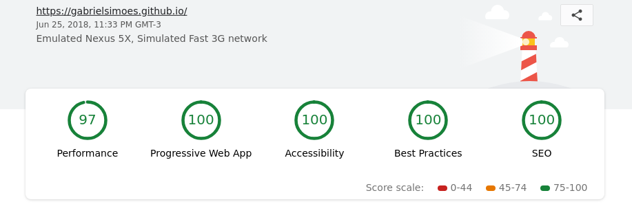

So, I'm starting my personal blog, and of course the first step was to actually
build it. I had heard about things like [Jekyll](https://jekyllrb.com/) and
[Hugo](https://gohugo.io/), but I decided not to use them. Why? Well, using one
of these tools isn't nearly as fun and rewarding as building it from scratch.

Also, I wanted to do a couple more non-standard things, such as using the same
datasource to build a reading/watching list and my PDF resume. So I thought
those tools wouldn't be aproppriate for that and I'd end up having to use two
different tools where I could use just one.

## Tools and project structure

Now, let's talk about what I used:

 {style="width: 150px; float: right;"}

- [Gulp](https://gulpjs.com/) for automating everything and wiring up the site
  generation. Gulp is also used to watch for changes while developing.
- [Pug](http://pugjs.org/) templating engine for creating the html structure.
- [SCSS](https://sass-lang.com/) to write CSS smartly.
- [markdown-it](https://github.com/markdown-it/markdown-it) for generating html
  from my markdown notes and articles. Also, a bunch of plugins to add support
  to code highlighting, latex, task lists, footnotes and heading anchors.
- [highlight.js](https://highlightjs.org/) together with markdown-it.
- [js-yaml](https://github.com/nodeca/js-yaml) to parse my YAML files with the
  information to generate the pages.
  [puppeteer](https://github.com/GoogleChrome/puppeteer) to generate the PDF CV.
- A bunch of minifying tools.

Project structure:

```
├── dist
├── node_modules
├── notes
│   ├── articles
│   ├── books
│   ├── talks
│   ├── books.yaml
│   ├── info.yaml
│   └── talks.yaml
├── src
│   ├── img
│   ├── js
│   ├── other
│   ├── pug
│   └── scss
├── gulpfile.js
└── package.json
```

The hardest part of the project was creating a custom gulp plugin that would
keep a list of all the blog posts and their front-matter info while it generates
the pages, so that it would be possible to later generate a page with all the
blog posts.

If you are really interested into this, you should take a look at the `gulpfile.js`
on the [website source](https://github.com/gabrielsimoes/gabrielsimoes.github.io).
But basically I'm using a function that creates a closured `data` object using
`js-yaml`. This function returns a gulp plugin that does the following: every
time a markdown file arrives through the stream, it generates a page using the
pug template, appends the frontmatter to the `data` object and pushes the file
down the stream.

## Generating the PDF Resume

The nicest part was using [puppeteer](https://github.com/GoogleChrome/puppeteer)
to generate the PDF resume. It seemed like a hard thing to do, but turned out to
be quite simple. I just had to write a custom CSS for printing and write a very
simple gulp task (it doesn't use streams though, but there is no need for that):

```javascript
gulp.task('cv', function(callback) {
  (async () => {
    var browser = await puppeteer.launch({args: ['--no-sandbox', '--disable-setuid-sandbox']});
    var page = await browser.newPage();
    await page.goto('file://' + path.join(__dirname, 'dist/cv-page.html'), {waitUntil: 'networkidle2'});
    await page.pdf({path: 'dist/cv.pdf', format: 'A4'});

    await browser.close();

    callback();
  })();
});
```

## Deploying

GitHub pages makes this a little harder than it could be, but nothing that we
can't handle. I created a `source` branch on the repo, and used it as the main
branch, leaving the `master` branch as a totally separate branch where I'd
commit the built website.

Now, how to easily commit the contents of the `dist` folder to the branch? I
used the [gh-pages](https://github.com/tschaub/gh-pages) plugin, coupled with
a simple gulp task:

```javascript
gulp.task('deploy', function(callback) {
  ghpages.publish('dist/', {
    branch: 'master',
    message: 'Update ' + new Date().toISOString()
  }, callback);
});
```

## Closing thoughts

Finally, I used [Lighthouse](https://developers.google.com/web/tools/lighthouse/)
to find out potential improvements to the website and ended up implementing a
a very simple Service Worker, which caches the static assets and front page. I
simply followed existing guides on how to do that, particularly [this one](https://gist.github.com/adactio/fbaa3a5952774553f5e7).

Plus some tweaks on the HTML files, and we got a really nice score:



I'm really happy with the result, especially since I learned a lot about how
Gulp really works and how to write plugins for it. I improved my usage of Pug
and SCSS, and also learned to use Chrome's Puppeteer.
