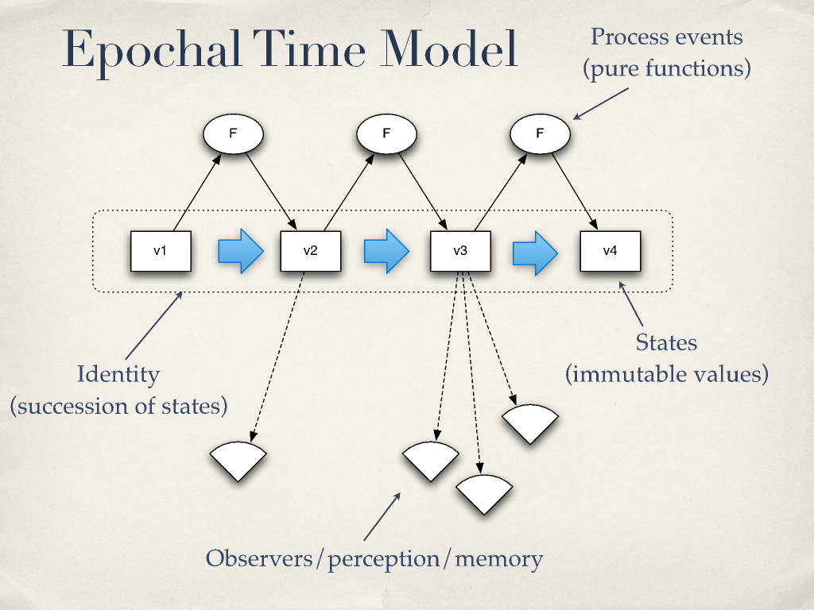
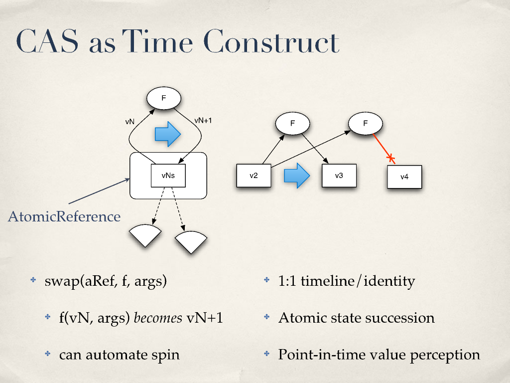
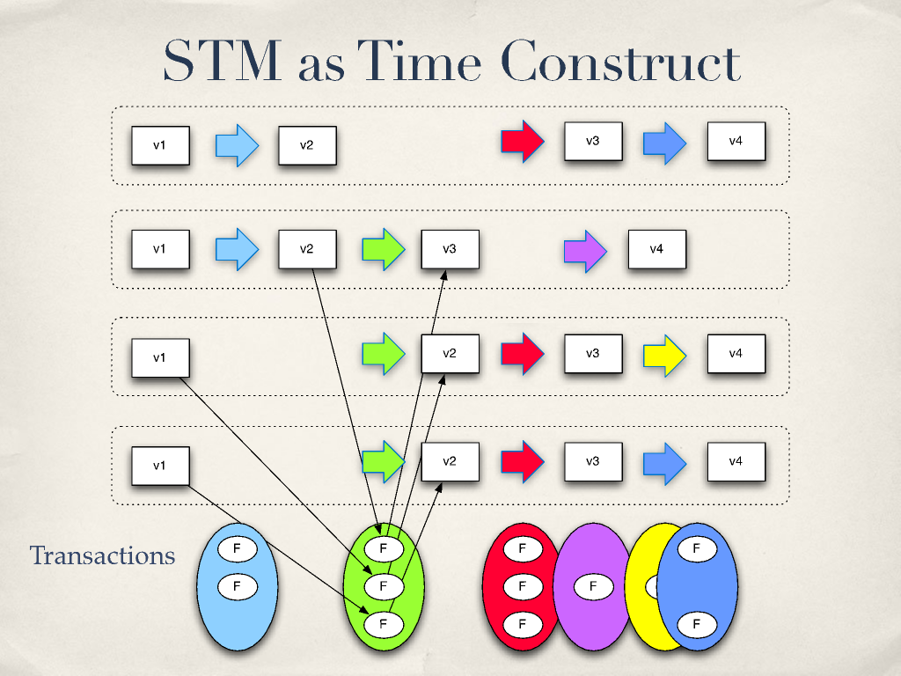

# Are We There Yet? - Rich Hickey

## Introduction

- All OO languages have fundamental things in common:
  - Single-dispatch, stateful OO.
  - Classes, inheritance, fields, methods, GC
- Differences are superficial: syntax, expressivity.
- C++:
  - Simple constructs, same syntax for heap/non-heap things.
  - Complexity: knowing when/if to delete.
  - No standard automatic memory management.
- Java:
  - Simple: only references to dynamic memory + GC.
  - Complexity: *knowing when you'll see a consistent value*.
- *Pure functions are Worry-Free*
- *But* not all programs are pure functions.

## Things we are doing wrong

- We created objects that can *change* in place.
- We left *time* out.
- Our languages have no notion of *values*.
- "No man can cross the same river twice." - Heraclitus
  - Actual entities are atomic immutable values
  - The future is a function of the past, it doesn't change it
  - We associate *identities* with a series of causally related values
  - Time is atomic, epochal succession of process events
- Terms
  - *Value*:  An *immutable* magnitude, quantity, number...
  - *Identity*: A succession of values whose causation is related.
  - *State*: *Snapshots*. Value of an identity at a *moment in time*.
  - *Time*: Relative before/after ordering of casual values.
- *Our programs try to "stop time" and know the state of everything to make decisions*.
  - Stadium analogy: "wait nobody move let me take a picture of the ball in mid-air".
- Truth is: *we are always perceiving the (unchanging!) past*.
- Our sensory systems have discretization and simultaneity detection.
- On the other hand, *action has to be sequential*.
  - No two things can affect the same thing at the same time.
  - We have to sort of take turns.
- Action and Perception are two different things.

## Epochal Time Model

- A point in time is a value - it can't be changed.
- Our program is still organized in identities (succession of states).
- We use pure functions to produce the feature.

## Implementation ideas

- We need constructs to represent values.
- We need constructs to coordinate the succession of values.
- We should consume memory to model time.
- GC cleans up longer-referenced 'past'.

- Use *persistent data structures*.
  - They are *immutable*.
  - Use trees + path copying.
- Time constructs.
  - Need to ensure atomic state succession.
  - Need to provide point-in-time perception.
  - Multiple timelines possible.
  - Many implementation strategies: CAS, Agents, STM, maybe even locks.

## CAS (Compare and Swap) as a Time Construct.

- Uncoordinated 1:1.
- Replaces state based on comparisons.

## Agents as a Time Construct

- Uncoordinated 1:1.
- Replaces state based on a queue through a thread pool.

## STM as a Time Construct

- Multiple timelines in the same app.
- A single transaction affects multiple timelines.
- ACI properties of ACID.

- Using a system that uses MVCC (Multi Version Concurrency Control), it is
  possible to percept snapshots.
- Keep history in order to satisfy readers.
- It allows readers to have their own notions of a timeline.
